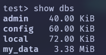
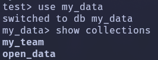
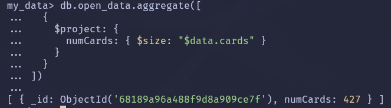
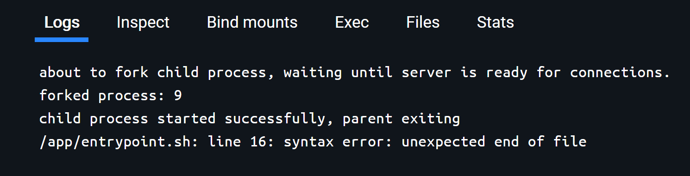
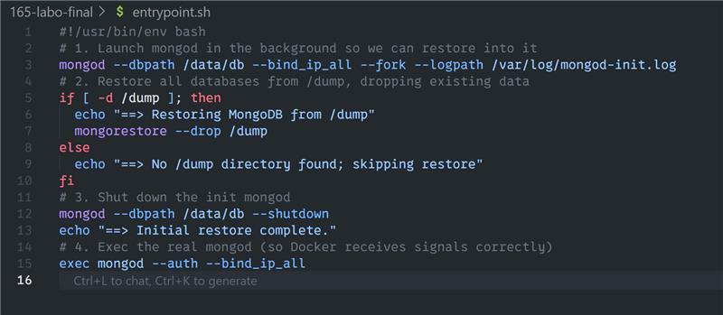

# Rendu du Labo 165 - NoSQL

## lien d'origine des données téléchargées + description des données + fichier JSON avec les données originales

#### Lien d'origine des données opendata

**Site web de la collection**
[Site MTG json](https://mtgjson.com/)

**Deck de cartes choisi (Set "Adventures in the Forgotten Realms" abrv. "AFR")**
[Set AFR (Adventures of the Forgotten Realms)](https://mtgjson.com/api/v5/AFR.json)

#### Description

Une liste exhaustive de toutes les cartes de la série "Adventures of the Forgotten Realms".
Une collaboration unique entre "Magic The Gathering" et "Dungeons and Dragons".

Cette base de donnée est très utile pour les joueurs compétitifs du jeu Magic
The Gathering. Elle permet de comparer les cartes et construire ses propres
mains (set de cartes choisies pour jouer contre un adversaire) avec grande
facilité.

#### Fichier des données originales
[AFR.json](./data/AFR.json)

## Exportation de ces collections en tant que JSON

[open_data](./rendu/open_data.json)

[my_team](./rendu/my_team.json)

## Pour chacune des questions suivantes : la commande mongosh à utiliser pour répondre à la question + le résultat d'exécution de la commande

### Questions :
1. Afficher les noms des BD disponibles dans le serveur

     

2. Afficher les noms des collections dans my_data

     

3. Compter le nombre des documents de chaque collection

      

## Rendre une sauvegarde du serveur et le mot de passe pour chaques utilisateurs:

### Sauvegarde
[open_data](./rendu/open_data.json)

### Mot de passe de tout les users

| Utilisateur   | Rôles                    | Base     | Mot de passe |
|---------------|--------------------------|----------|--------------|
| myUserAdmin   | userAdminAnyDatabase     | admin    | pwd          |
| myUserAdmin   | readWriteAnyDatabase     | admin    | pwd          |
| userModify    | readWrite                | my_data  | pwd          |
| userPlus      | backup                   | admin    | pwd          |


## Le code de l’application + Read-me avec instructions d’utilisation et de déploiement,

### Code de l'application

Le code de l'application se trouve dans 
[./rendu/python_flask/](./rendu/python_flask/)

Le `README.md` se trouve dans le root du projet.

Le backend mongodb est un container docker dans lequel on importe les données
contenues dans [./rendu/data/backup/](./rendu/data/backup/)

## Instructions d'utilistation

1. Lancez le container docker avec Docker Compose dans le root du projet.
```bash
# Dans le root du projet
docker compose up
```

### Debug

1. Collision de container ou de nom d'image
    Si vous suspectez une collision de container, utilisez cette commande pour
    supprimer tout les containers, toutes les images et tout les volumes docker
    actuellement sur votre système.
    
    > [!WARNING]
    > Cela supprime TOUT. Cela inclu les projets des autres ainsi que les vôtres !
    > Cette action est iréverssible !
    
    ```bash
    docker rm $(docker ps -aq) && \
    docker rmi -f $(docker images -aq) && \
    docker volume rm --force $(docker volume ls -q)
    ```
2. Problème lors du git clone de `entrypoint.sh`

    Si vous utilisez le code inclus dans le zip, ce problème n'est en théorie
    pas possible.

    Si vous avez cloné depuis github ce projet sur Windows 10/11, il se peut
    que `entrypoint.sh` ait une ligne vide ajoutée qui pose problème lors de la
    copie du code dans le container mongodb.

    
    
    
